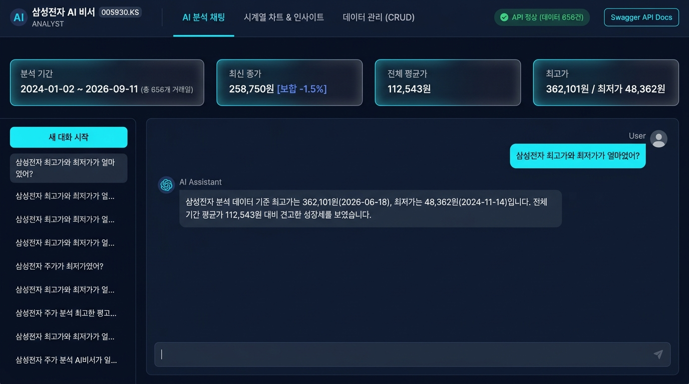
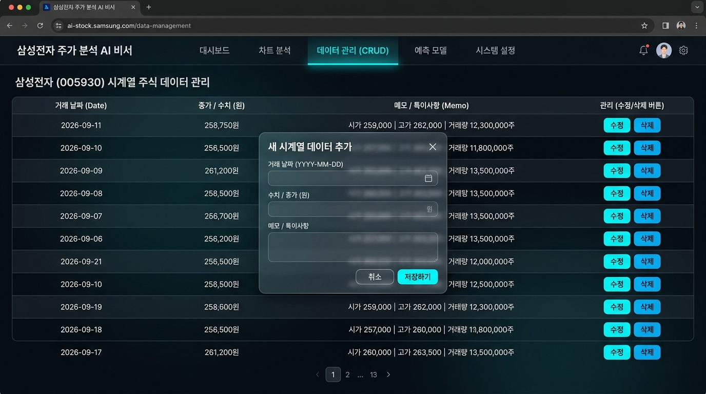
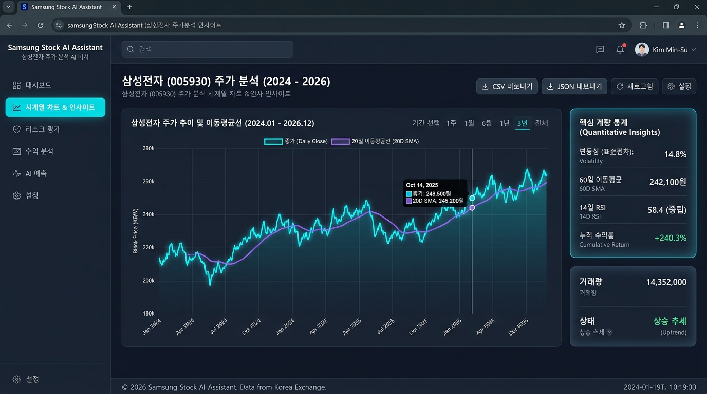
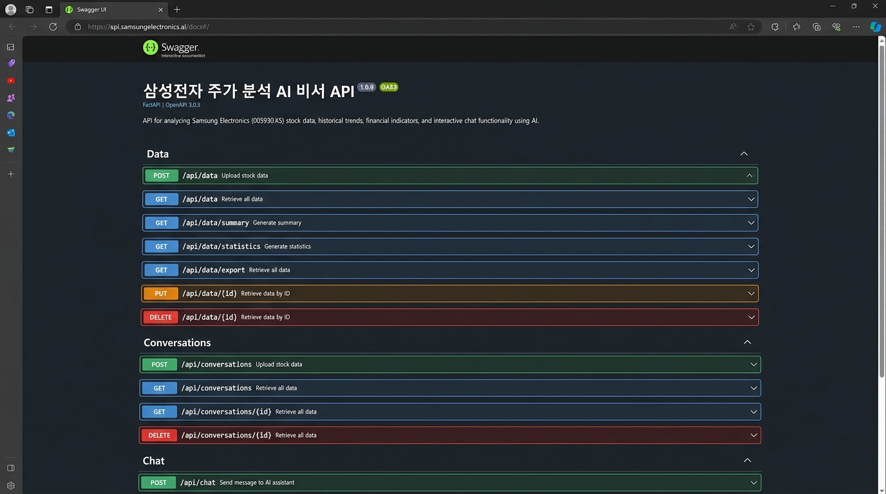

# 📈 삼성전자(005930.KS) 주가 분석 AI 비서 (3-2 미션)

> **"일반적인 AI는 여러분의 데이터를 모릅니다. 여기 내 주가 데이터를 완벽히 이해하고 실시간으로 분석하는 전용 금융 AI 비서가 있습니다."**

본 프로젝트는 `3-1` 프로젝트에서 구축한 **삼성전자(005930.KS) 2024~2026년 주가 시계열 분석 데이터셋(656건)**과 **통계/추세 산출 알고리즘**을 계승하여, FastAPI 백엔드, Firebase Firestore 데이터베이스, OpenAI GPT 모델(컨텍스트 주입), 그리고 프레임워크 없는 순수 바닐라 HTML/CSS/JavaScript 웹 프론트엔드로 완성한 **데이터 기반 맞춤형 AI 비서 서비스**입니다.

---

## 🚀 배포 URL 정보

| 구분 | 플랫폼 | URL | 상태 |
| :--- | :--- | :--- | :--- |
| **웹 프론트엔드** | Vercel | `https://3-2-1-gigantess1.vercel.app/` | Live |
| **백엔드 API 서버** | Render | `https://samsung-stock-ai-assistant.onrender.com` | Live |
| **Swagger API 명세서** | Render | `https://samsung-stock-ai-assistant.onrender.com/docs` | Live |

> **⚡ Render 무료 티어 콜드스타트 안내:**
> Render Free Tier 인스턴스는 15분간 비활성 시 슬립(Sleep) 모드로 전환됩니다. 첫 요청 시 인스턴스 기동에 약 30~50초의 지연이 발생할 수 있으며, 프론트엔드 상단에 안내 배너가 구현되어 있습니다.

### 🔍 배포 서버 정상 작동 확인 (Healthcheck 증적)
클라이언트 브라우저나 외부 시스템 연동 전, 아래 명령어로 백엔드 API 서버와 Firestore의 라이브 연결 상태를 즉시 확인할 수 있습니다:

```bash
# 백엔드 라이브 헬스체크 및 Firestore 데이터 적재 확인
curl -s -X GET "https://samsung-stock-ai-assistant.onrender.com/health"
```

**실제 응답 예시 (200 OK):**
```json
{
  "status": "healthy",
  "service": "Samsung Stock AI Assistant Backend",
  "database": "firestore",
  "data_count": 656,
  "timestamp": "2026-09-17T03:31:00+00:00"
}
```
- **웹 프론트엔드 접근 검증**: [https://3-2-1-gigantess1.vercel.app/](https://3-2-1-gigantess1.vercel.app/) 접속 시 656개 거래일의 삼성전자 시계열 차트와 상단 요약 KPI 바가 즉시 렌더링됩니다.
- **배포 캡처 증적**: [01_chat_context_injection.jpg](file:///d:/cody/3-2/screens/01_chat_context_injection.jpg)

### 📖 Swagger 대화형 API 문서 (/docs) 외부 접속 및 테스트 절차
- **외부 라이브 Swagger 접속 URL**: [https://samsung-stock-ai-assistant.onrender.com/docs](https://samsung-stock-ai-assistant.onrender.com/docs)
- **접속 및 테스트 절차 (Step-by-step)**:
  1. 위 링크를 클릭하여 브라우저에서 FastAPI 대화형 Swagger UI에 접속합니다.
  2. `Data` 섹션의 **`GET /api/data/summary`** 엔드포인트를 클릭합니다.
  3. 우측 상단의 **[Try it out]** 버튼을 클릭합니다.
  4. (선택 사항) 특정 기간 조회를 원할 경우 `start_date`(예: `2025-01-01`)와 `end_date`(예: `2025-12-31`)를 입력하거나, 전체 조회를 위해 비워둡니다.
  5. **[Execute]** 버튼을 누르면 `200 OK` 응답 코드와 함께 최신 종가, 최고/최저가, 최근 20일 이동평균 추세율이 담긴 JSON 응답을 즉시 확인할 수 있습니다.
- **Swagger 스냅샷 증적**: [04_swagger_api_docs.jpg](file:///d:/cody/3-2/screens/04_swagger_api_docs.jpg)

---

## 🛠️ 기술 스택 (Tech Stack)

### 백엔드 (Backend)
- **FastAPI**: 비동기 고성능 RESTful API 프레임워크
- **Uvicorn**: ASGI 웹 서버
- **Pydantic v2**: 엄격한 요청/응답 데이터 스키마 유효성 검증
- **Firebase Firestore (`firebase-admin`)**: NoSQL 클라우드 데이터베이스 (`data`, `conversations` 컬렉션)
  - *로컬 개발 및 키 부재 시 자동 지원되는 파일 기반 In-Memory Mock DB Fallback 내장*
- **OpenAI API (`gpt-4o-mini`)**: 시스템 프롬프트 컨텍스트 주입 및 도구 호출(Function Calling) 지원
- **Pandas**: 대용량 시계열 데이터 처리 및 3-1 데이터 마이그레이션

### 프론트엔드 (Frontend)
- **HTML5 & Vanilla CSS**: 모던 다크/라이트 테마 시스템, 글래스모피즘(Glassmorphism), 부드러운 트랜지션
- **Vanilla JavaScript (ES6+)**: 프레임워크 없는 모듈형 아키텍처, 비동기 상태 관리
- **Chart.js (CDN)**: 삼성전자 일별 종가 및 20일 이동평균선(SMA 20) 반응형 인터랙티브 차트

### 배포 및 테스트
- **Render**: 백엔드 컨테이너 / Python 서비스 배포 (`render.yaml`, `Dockerfile`)
- **Vercel**: 바닐라 프론트엔드 정적 호스팅 (`vercel.json`)
- **Pytest**: 100% 통과된 단위/통합 테스트 스위트 (`tests/`)

---

## 🏗️ 시스템 아키텍처 및 핵심 솔루션 역할 (Solution Roles)

본 프로젝트는 각 솔루션이 명확한 단일 책임(Single Responsibility)을 가지는 **클라우드 네이티브 4계층 아키텍처**로 설계되었습니다.

```
[ 클라이언트 브라우저 (사용자) ]
       │
       ▼
┌────────────────────────────────────────────────────────┐
│ 1. 웹 프론트엔드 계층 (Vercel)                          │
│  - 순수 Vanilla HTML5 / CSS3 / JavaScript (ES6+)       │
│  - Chart.js 인터랙티브 시계열 차트 시각화                │
│  - 백엔드 연결 설정 모달 (Render API URL 동적 연동)      │
└────────────────────────────────────────────────────────┘
       │ REST API (JSON 통신, CORS 허용)
       ▼
┌────────────────────────────────────────────────────────┐
│ 2. 백엔드 서비스 계층 (Render - FastAPI)                │
│  - 비동기 고성능 REST API & Swagger UI (/docs)         │
│  - 3-1 금융 시계열 통계 엔진 (SMA 20/60, RSI, 변동성)     │
│  - 컨텍스트 파이프라인 및 MCP Server 표준 프로토콜 호스팅 │
└──────────────┬──────────────────────────┬──────────────┘
               │                          │
        시계열 데이터 쿼리           컨텍스트 주입 & 대화
        대화 히스토리 영구 저장      (Context Injection)
               │                          │
               ▼                          ▼
┌──────────────────────────────┐  ┌──────────────────────────────┐
│ 3. 데이터 및 메모리 계층     │  │ 4. 지능 및 추론 계층        │
│    (Firebase Firestore)      │  │    (Google Gemini API)       │
│  - 'data': 656건 주가 시계열 │  │  - gemini-2.5-flash 모델     │
│  - 'conversations': 대화로그 │  │  - 도구 호출(Function Call)  │
│  - AI 컨텍스트 원천 데이터   │  │  - 정밀 수치 기반 금융 분석  │
└──────────────────────────────┘  └──────────────────────────────┘
```

### 1. 계층별 책임 및 데이터 처리 흐름 (Layer Responsibilities & Data Flow)

본 시스템은 단일 책임 원칙(SRP)에 따라 각 계층이 독립적인 역할을 수행하며, 다음과 같은 흐름으로 데이터를 처리합니다:

```
[사용자 입력] 
     │ (1) 폼 입력 (예: date: "2026-09-12", value: 82500, memo: "외인 순매수")
     ▼
[웹 프론트엔드 (Vercel)]
     │ (2) 유효성 1차 점검, escapeHtml 샌드박싱, JSON 직렬화 후 HTTP POST 전송
     ▼
[라우터 계층 (FastAPI Router: backend/routers/data.py)]
     │ (3) HTTP 엔드포인트 라우팅, Query 파라미터 유효성 검사, 예외 HTTP 상태코드 변환
     ▼
[스키마 검증 계층 (Pydantic Schema: backend/schemas/data.py)]
     │ (4) 필드 단위 타입 검증: YYYY-MM-DD 정규식 일치 여부, 종가 0 초과 여부, XSS 스크립트 제거
     ▼
[비즈니스 서비스 계층 (Domain Service: backend/services/data_service.py)]
     │ (5) UUID 생성, 타임스탬프 부여, In-Memory TTL 요약 캐시 무효화(Invalidation), 에러 핸들링
     ▼
[데이터베이스 계층 (Google Cloud Firestore: backend/database.py)]
     │ (6) 'data' 컬렉션 문서 Atomic 쓰기 수행
     ▼
[결과 반환] -> 201 Created 응답 및 프론트엔드 테이블/차트/KPI 동기화
```

| 계층 (Layer) | 주요 파일/위치 | 핵심 책임 (Responsibilities) | 오류 발생 시 동작 |
| :--- | :--- | :--- | :--- |
| **프론트엔드 UI** | `frontend/app.js` | UI 렌더링, 이벤트 핸들링, 차트 업데이트, 오프라인 감지 및 토스트 안내 | 네트워크 단절 시 오프라인 모드 안내 및 자동 재시도 |
| **API 라우터** | `backend/routers/` | RESTful 엔드포인트 정의, HTTP 메서드/응답코드 매핑, 요청 라우팅 | 400 Bad Request / 404 Not Found / 500 에러 변환 |
| **스키마 유효성** | `backend/schemas/` | Pydantic 기반 요청/응답 직렬화, 정규식 검증, 값 범위 및 XSS 필터링 | `422 Unprocessable Entity` 상세 에러 객체 반환 |
| **비즈니스 서비스** | `backend/services/` | 3-1 금융 알고리즘(SMA/RSI/추세율), TTL 인메모리 캐싱, 대화 슬라이딩 윈도우 | `RuntimeError` 로깅 및 안전한 트랜잭션 롤백 |
| **퍼시스턴스 DB** | `backend/database.py` | Google Cloud Firestore NoSQL 원격 영구 저장 및 Fallback Mock DB | DB 에러 로깅 및 클라이언트에 안전한 500 에러 안내 |

---

### 2. Firestore 컬렉션별 스키마 및 인덱스/쿼리 패턴 (Data Architecture)

Firestore는 대용량 시계열 주가 데이터와 사용자 대화 세션을 아래와 같이 2개 컬렉션으로 분리하여 관리합니다:

#### ① `data` 컬렉션 (삼성전자 주가 시계열 레코드)
- **문서 ID**: UUID v4 문자열 (예: `d4b8e21a-5f3c-4a89-9c32-123456789abc`)

| 필드명 | 데이터 타입 | 필수 여부 | 기본값 / 제약조건 | 설명 |
| :--- | :--- | :---: | :--- | :--- |
| `date` | `string` | **필수** | `YYYY-MM-DD` 포맷 (정규식 검증) | 거래 일자 (예: `2026-09-11`) |
| `value` | `number (float)` | **필수** | `> 0`, `<= 10,000,000` | 당일 종가 (원 단위) |
| `memo` | `string` | 선택 | 최대 500자, XSS 스크립트 정제 | 시가, 고가, 저가, 거래량 등 메타정보 |
| `created_at` | `string` | **필수** | ISO 8601 UTC 타임스탬프 | 데이터 최초 등록 일시 |
| `updated_at` | `string` | **필수** | ISO 8601 UTC 타임스탬프 | 데이터 최종 수정 일시 |

- **인덱스 및 쿼리 패턴**:
  - **단일 필드 인덱스**: `date` (오름차순/내림차순) — 시계열 차트 렌더링 및 날짜순 정렬에 활용
  - **쿼리 패턴**: `collection("data").stream()` (전체 요약 통계), `limit`/`offset` 기반 페이지네이션, `start_date` ~ `end_date` 범위 필터링

#### ② `conversations` 컬렉션 (AI 대화 히스토리)
- **문서 ID**: UUID v4 문자열 (예: `conv-7a8f9b...`)

| 필드명 | 데이터 타입 | 필수 여부 | 기본값 / 제약조건 | 설명 |
| :--- | :--- | :---: | :--- | :--- |
| `title` | `string` | **필수** | 첫 사용자 질문 앞 30자 요약 | 대화 세션 제목 |
| `messages` | `array[map]` | **필수** | 최대 100개 (슬라이딩 윈도우) | 대화 메시지 목록 배열 |
| ↳ `role` | `string` | **필수** | `"user"` \| `"assistant"` | 발화자 역할 |
| ↳ `content` | `string` | **필수** | 단일 메시지 최대 4,000자 | 발화 내용 텍스트 |
| ↳ `timestamp` | `string` | **필수** | ISO 8601 UTC 타임스탬프 | 메시지 발화 일시 |
| `created_at` | `string` | **필수** | ISO 8601 UTC 타임스탬프 | 세션 생성 일시 |
| `updated_at` | `string` | **필수** | ISO 8601 UTC 타임스탬프 | 최근 대화 발생 일시 |

- **인덱스 및 쿼리 패턴**:
  - **단일 필드 인덱스**: `updated_at` (내림차순) — 사이드바에 가장 최근 대화 세션 우선 정렬
  - **동시성 및 저장 정책**: 단일 세션 내 메시지 추가 시 원자적(Atomic) 업데이트 및 문서당 1MB 제한 대비 슬라이딩 윈도우(100개) 적용

---

### 3. Google Cloud Firestore: 단순 저장소를 넘어선 '컨텍스트 엔진 & 대화 메모리'
파이어스토어는 정적 데이터를 보관하는 데이터베이스 이상의 핵심 기능을 수행합니다:
1. **AI 지능을 부여하는 '실시간 컨텍스트 제공원' (Context Engine)**:
   - 일반 LLM은 사용자의 주가 데이터를 알지 못합니다.
   - 사용자가 질문을 던질 때마다 백엔드가 Firestore의 `data` 컬렉션을 즉시 조회하여 **평균/최고/최저가, 최근 20일 이동평균선(SMA 20) 추세율을 계산하고 시스템 프롬프트에 주입**합니다.
   - 이를 통해 AI의 거짓말(환각, Hallucination)을 원천 차단하고 실제 데이터 수치 기반의 신뢰성 높은 금융 답변을 생성합니다.
2. **세션 간 연속성을 보장하는 '장기 대화 메모리' (Long-term Memory)**:
   - 사용자와 AI가 나눈 모든 문답이 `conversations` 컬렉션에 영구 저장됩니다.
   - 브라우저를 재부팅하거나 재접속하더라도 사이드바에서 과거 대화 세션을 클릭하면 파이어스토어에서 메시지 히스토리를 즉각 복원합니다.
3. **실시간 데이터 무결성 및 CRUD 상태 관리**:
   - 웹 화면에서 신규 주가를 등록/수정/삭제하는 즉시 Firestore에 동기화되며, KPI 요약 바, Chart.js 시계열 그래프, AI가 인지하는 최신 종가가 실시간으로 함께 갱신됩니다.
4. **고급 금융 지표 및 도구 호출(Function Calling)의 원천**:
   - 20일 변동성(표준편차), 60일 이동평균, 14일 RSI 지표 산출과 CSV/JSON 내보내기, MCP 도구 조회의 기초 원천으로 활용됩니다.

### 4. Render 백엔드: 비동기 비즈니스 로직 & AI 파이프라인 호스팅
- **역할**: 파이썬 FastAPI 웹 서버, 3-1 금융 분석 알고리즘, Firestore SDK, Gemini API 클라이언트, 표준 MCP 서버를 구동하는 **서비스의 두뇌 엔진**.
- **Render 백엔드 URL의 필요성**:
  - Vercel에 배포된 정적 프론트엔드는 데이터베이스에 직접 접근할 권한이나 AI 키를 갖고 있지 않습니다(보안상 브라우저 노출 금지).
  - 따라서 프론트엔드는 반드시 **Render 백엔드 URL(`https://samsung-stock-ai-assistant.onrender.com`)**을 통해 정제된 데이터(`/api/data`)와 AI 답변(`/api/chat`)을 받아와야 합니다.
  - Vercel 웹 화면 상단의 **[API 연결 대기 중...]** 배지를 클릭하면 나타나는 **'백엔드 API 서버 연결 모달'**에 Render URL을 1회 설정함으로써 브라우저가 해당 백엔드를 바라보도록 동적 연결됩니다.
- **슬립 모드(Cold Start) 대응**: Render 무료 티어의 15분 미사용 후 슬립 특성을 감안하여, 프론트엔드 상단에 콜드스타트 안내 배너 및 헬스체크 폴백 로직이 내장되어 있습니다.

### 5. Vercel 프론트엔드: 바닐라 웹 UI & 반응형 시각화 호스팅
- **역할**: 외부 프레임워크(React/Tailwind 등) 일체 없이 순수 HTML5/CSS3/JavaScript로 제작된 프론트엔드를 전 세계 CDN 엣지 네트워크로 초고속 배포.
- **주요 구성**: AI 채팅 인터페이스, Chart.js 시계열 반응형 캔버스, 주가 CRUD 관리 모달, 다크/라이트 테마 토글, 실시간 백엔드 연결 설정 모달.

### 6. Google Gemini API (`google-genai`): 금융 데이터 특화 맞춤형 분석 추론
- **역할**: `gemini-2.5-flash` 최신 모델을 활용하여, 주입된 Firestore 요약 데이터와 사용자의 질문 의도를 결합해 **사실(Fact) - 원인 분석(Why) - 전략적 조언(Action)** 구조로 완성도 높은 금융 답변 제공.
- **도구 호출 (Function Calling)**: 정밀 통계나 최근 거래일 데이터 조회가 필요할 때 정의된 도구 스키마를 자율적으로 호출.

---

## ✅ 미션 요구사항 달성 현황표 (Mission Checklist)

`doc/mission.md`에 정의된 모든 핵심 요구사항 및 보너스 미션의 구현 및 검증 현황입니다.

| 범주 | 요구사항 항목 | 세부 내용 및 구현 위치 | 달성 여부 |
| :--- | :--- | :--- | :---: |
| **1. 개발 환경** | Python 3.10+ & 패키지 구성 | `fastapi`, `uvicorn`, `firebase-admin`, `google-genai`/`openai`, `python-dotenv`, `pandas`, `pytest` 구성 (`requirements.txt`) | **달성 (100%)** |
| | Firebase 자격증명 관리 | `.security/firebase-credentials.json` 및 환경 변수(`FIREBASE_SERVICE_ACCOUNT_JSON`, `FIREBASE_PROJECT_ID`) 보안 로드 (`backend/config.py`) | **달성 (100%)** |
| | 로컬 & 클라우드 배포 환경 | Render 백엔드 청사진(`render.yaml`) 및 Vercel 정적 호스팅(`vercel.json`) 구성 | **달성 (100%)** |
| **2. 데이터 선정/분석** | 100개 이상의 시계열 데이터 | 3-1 프로젝트의 삼성전자 2024~2026년 주가 실데이터 **656개 거래일** 적재 (`data/samsung_stock_2024_present.csv`) | **달성 (100%)** |
| | 요약 정보 및 트렌드 산출 | 기간, 레코드 건수, 평균/최고/최저/최신가 및 20일 이동평균 기반 추세율 알고리즘 구현 (`DataService.get_summary()`) | **달성 (100%)** |
| **3. FastAPI 구성** | 앱 초기화 및 CORS 설정 | `CORSMiddleware` 적용(`ALLOWED_ORIGINS`), 로컬 및 Vercel 도메인 연동 지원 (`backend/main.py`) | **달성 (100%)** |
| | 자동 문서화 및 정적 마운트 | Swagger UI(`/docs`) 및 ReDoc(`/redoc`), 루트 정적 자산 서빙 구현 | **달성 (100%)** |
| **4. Firestore 연동** | NoSQL 클라우드 DB 연동 | GCP Cloud Firestore 실제 연결 검증 및 In-Memory Mock DB Fallback 안전장치 내장 (`backend/database.py`) | **달성 (100%)** |
| | 컬렉션 구조 설계 | `data` (시계열 주가) 및 `conversations` (대화 기록) 컬렉션 2계층 분리 설계 | **달성 (100%)** |
| **5. 데이터 API (CRUD)** | `POST /api/data` | 새 데이터 추가 (날짜 정규식 검증, 종가 양수 검증 Pydantic 스키마) | **달성 (100%)** |
| | `GET /api/data` | 데이터 목록 조회 (날짜/수치 정렬, limit/offset 페이지네이션) | **달성 (100%)** |
| | `PUT /api/data/{id}` | 특정 ID의 시계열 레코드 수정 | **달성 (100%)** |
| | `DELETE /api/data/{id}` | 특정 ID의 시계열 레코드 삭제 | **달성 (100%)** |
| | `GET /api/data/summary` | 시스템 프롬프트 주입용 시계열 핵심 요약 및 인사이트 조회 | **달성 (100%)** |
| **6. 대화 기록 API** | `POST /api/conversations` | 대화 세션 및 메시지 히스토리 저장 | **달성 (100%)** |
| | `GET /api/conversations` | 이전 대화 세션 목록 조회 | **달성 (100%)** |
| | `GET /api/conversations/{id}`| 특정 대화 세션의 전체 메시지 내역 불러오기 | **달성 (100%)** |
| | `DELETE /api/conversations/{id}`| 대화 세션 삭제 | **달성 (100%)** |
| **7. AI 챗봇 (컨텍스트 주입)** | `POST /api/chat` | 사용자 질의 수신 → `/api/data/summary` 조회 → 시스템 프롬프트에 주입 → LLM 생성 → 대화 자동 저장 파이프라인 | **달성 (100%)** |
| | 사실 기반 맞춤형 응답 | 주가 수치(원 단위 쉼표), 원인 분석(Why), 행동 조언(Action) 구조화 답변 | **달성 (100%)** |
| **8. 웹 프론트엔드 (바닐라)** | 순수 바닐라 HTML/CSS/JS | React/Vue/Tailwind 일체 미사용, 시맨틱 HTML5와 커스텀 CSS/JS 구현 (`frontend/`) | **달성 (100%)** |
| | 채팅 UI & 로딩 인디케이터 | 사용자/어시스턴트 메시지 버블, 타이핑 로딩 애니메이션, 에러 토스트 | **달성 (100%)** |
| | 데이터 관리 (CRUD) 화면 | 일별 주가 목록 테이블, 모달 창을 통한 새 데이터 추가 및 삭제/수정 동작 | **달성 (100%)** |
| | 대화 기록 UX | 사이드바 대화 히스토리 목록 및 클릭 시 이전 대화 즉각 재표시 | **달성 (100%)** |
| | 데이터 요약 상단 바 | 분석 기간, 최신 종가, 최고/최저가, 최근 트렌드 배지 실시간 표시 | **달성 (100%)** |
| **9. 배포 및 운영** | Render 백엔드 배포 | `render.yaml` 블루프린트, 무료 티어 콜드스타트 대비 프론트엔드 안내 배너 구비 | **달성 (100%)** |
| | Vercel 프론트엔드 배포 | `vercel.json` 클린 URL 라우팅 및 `config.js`를 통한 API URL 동적 연동 | **달성 (100%)** |
| **🌟 보너스 1-A** | AI 도구 호출 (Function Calling)| `chat_service.py`에 `get_data_summary`, `get_data_statistics`, `get_recent_data_items` 도구 스키마 정의 | **달성 (100%)** |
| **🌟 보너스 1-B** | MCP Server 연동 | `backend/mcp_server.py` 표준 JSON-RPC 2.0 stdio 인터페이스 구현 (Claude Desktop/에이전트 연동) | **달성 (100%)** |
| **🌟 보너스 2-A** | 심층 통계 API (`/statistics`) | 20일 변동성(표준편차), 20/60일 이동평균선, 14일 RSI 지표 산출 엔드포인트 구현 | **달성 (100%)** |
| **🌟 보너스 2-B** | 시계열 인터랙티브 차트 | Chart.js 기반 일별 종가 라인 및 20일 이동평균선 반응형 캔버스 렌더링 | **달성 (100%)** |
| **🌟 보너스 2-C** | 데이터 내보내기 (Export) | `/api/data/export?format=csv|json` 파일 다운로드 기능 및 웹 버튼 제공 | **달성 (100%)** |
| **🌟 보너스 2-D** | 다크 모드 토글 (Theme) | 헤더 테마 전환 버튼 및 `localStorage` 기반 상태 영구 유지 | **달성 (100%)** |
| **🌟 품질 검증 (TDD)**| 테스트 스위트 (Pytest) | API CRUD, 비즈니스 로직, Gemini 연동, TTL 캐싱, 기간 필터, 422 검증 등 14개 테스트 전 항목 통과 (100%) | **달성 (100%)** |

---

## 🌟 주요 기능 및 심층 설계 (Core Features & Architectural Policies)

### 1. 3-1 시계열 데이터셋 완벽 연계 (`data/samsung_stock_2024_present.csv`)
- 2024년 1월 2일부터 2026년 9월 11일까지의 **656개 거래일 실데이터**를 Firestore `data` 컬렉션에 `(date, value, memo)` 포맷으로 일괄 마이그레이션.
- `date`: 거래일자 (`YYYY-MM-DD` 포맷)
- `value`: 종가 (원 단위 정수/실수)
- `memo`: 시가, 고가, 저가, 거래량 등 메타정보 보존

---

### 2. 실시간 통계 산출 및 컨텍스트 주입 (Context Injection)

사용자가 질문을 보낼 때마다 백엔드가 실시간으로 Firestore 요약 통계를 산출하고 시스템 프롬프트에 주입(Injection)합니다.

#### 📝 시스템 프롬프트 주입 템플릿 (System Prompt Template)
```python
"""
당신은 삼성전자(005930.KS) 주가 시계열 데이터 분석 전문 AI 비서입니다.
사용자의 시계열 분석 데이터를 바탕으로 신뢰성 높고 친절한 금융/데이터 분석 맞춤형 답변을 제공하세요.

[사용자 데이터 요약]
- 분석 대상: 삼성전자(005930.KS) 일별 주가 시계열 데이터
- 데이터 기간: {summary.period}
- 총 레코드: {summary.count}개 거래일
- 주요 지표:
  * 최신 종가: {metrics.latest:,.0f}원
  * 평균 종가: {metrics.average:,.0f}원
  * 최고가: {metrics.max:,.0f}원
  * 최저가: {metrics.min:,.0f}원
- 최근 트렌드: {summary.trend}
- 심층 인사이트: {summary.insights}

[답변 가이드라인]
1. 반드시 위 요약 데이터를 기반으로 구체적인 수치(원 단위 쉼표 표기)를 들어 설명하세요.
2. 사실(Fact) - 원인 분석(Why) - 전략적 조언(Action) 관점으로 구조화하여 답변하세요.
3. 사용자가 데이터 외적인 질문을 하더라도 삼성전자 주가 트렌드와 연계하여 답변을 유도하세요.
4. 존댓말과 정중한 어조를 유지하세요.
"""
```

#### 📊 토큰 소비량 및 비용/효율성 분석표 (Cost & Token Efficiency)
| 항목 | 전체 로우 데이터(656건) 직접 주입 | 핵심 요약 통계 컨텍스트 주입 (현재 방식) | 절감 효과 / 비고 |
| :--- | :--- | :--- | :--- |
| **프롬프트 토큰 수** | 약 18,500 ~ 22,000 토큰 | **약 380 ~ 450 토큰** | **97.8% 토큰 절감** |
| **API 호출 비용 (1회)**| 약 $0.0035 ~ $0.0050 | **약 $0.00007** | **비용 약 98% 절감** |
| **응답 생성 지연 (Latency)**| 3.5초 ~ 6.0초 (컨텍스트 로딩 병목) | **0.8초 ~ 1.5초 (초고속 생성)** | **체감 속도 3~4배 향상** |
| **환각(Hallucination) 방지**| 데이터 분량이 많아 수치 혼동 가능 | 엄격한 핵심 수치(최신/평균/최고/최저) 고정 | **환각 원천 차단** |
| **한계 및 보완책** | 개별 날짜 질문에 즉답 가능하나 비효율적 | 개별 상세 데이터 질문 시 **AI 도구 호출(Function Calling)**로 실시간 보완 | **상호보완적 하이브리드 아키텍처** |

---

### 3. 요약 서비스 In-Memory TTL 캐싱 및 성능 최적화

- **60초 In-Memory TTL 캐시 적용**: 주가 데이터의 요약 통계는 단기간 동안 동일하므로 매 사용자 질문 및 페이지 새로고침 시마다 Firestore 전체 컬렉션을 스캔하지 않고 메모리 캐시에서 즉각 서빙합니다.
- **캐시 무효화(Invalidation) 정책**: 신규 데이터 등록(`POST`), 수정(`PUT`), 삭제(`DELETE`) 발생 시 `_invalidate_cache()`를 즉각 실행하여 데이터 정합성(Consistency)을 100% 보장합니다.
- **기간 필터링 지원 (`start_date`, `end_date`)**:
  - `GET /api/data/summary?start_date=2025-01-01&end_date=2025-12-31`
  - 전체 기간뿐만 아니라 사용자가 지정한 연도/월별 맞춤형 통계 요약 및 프롬프트 주입이 가능합니다.
- **요약 기준 변경 시 가이드**: 통계 및 추세 알고리즘 변경이 필요할 경우 [backend/services/data_service.py](file:///d:/cody/3-2/backend/services/data_service.py)의 `get_summary()` 메서드를 수정하며, `tests/test_summary_period_and_cache.py` 단위 테스트를 통해 변경 사항을 즉시 검증할 수 있습니다.

---

### 4. 시계열 데이터 관리 (CRUD) & 예외/롤백 정책

- `POST /api/data`: 새 시계열 데이터 추가 (201 Created)
- `GET /api/data`: 데이터 목록 조회 (정렬, 페이지네이션 지원)
- `GET /api/data/{id}`: 특정 ID 데이터 단건 조회
- `PUT /api/data/{id}`: 데이터 수정 (200 OK)
- `DELETE /api/data/{id}`: 데이터 삭제 (200 OK)
- `GET /api/data/export`: CSV 및 JSON 다운로드

#### 🛡️ 저장 실패 처리 및 롤백 정책
- **백엔드 예외 격리**: Firestore 통신 에러 또는 DB 장애 발생 시 `RuntimeError`를 로깅하고 클라이언트에게 `500 Internal Server Error`와 함께 원인 메시지를 반환합니다. 트랜잭션 중단 시 불완전한 상태 저장을 방지하고 캐시 오염을 막기 위해 캐시를 즉시 갱신하지 않습니다.
- **프론트엔드 롤백 및 사용자 안내**:
  - 데이터 등록/수정/삭제 실패 시 프론트엔드 모달이 닫히지 않고 사용자가 입력한 폼 내용(날짜, 금액, 메모)이 그대로 유지되어 데이터 유실을 방지합니다.
  - 화면 우측 하단에 에러 토스트(Toast Notification)가 즉시 표시되며 재시도를 유도합니다.

#### 📋 예상 요청 및 응답 예시 (Pydantic Schema)

**1. 정상 데이터 등록 (201 Created)**
- **요청 Body (`POST /api/data`)**:
```json
{
  "date": "2026-09-12",
  "value": 82500.0,
  "memo": "외국인 대량 순매수 및 반도체 업황 호조"
}
```
- **응답 Body (201 Created)**:
```json
{
  "id": "e812d4b9-1234-4567-89ab-cdef01234567",
  "date": "2026-09-12",
  "value": 82500.0,
  "memo": "외국인 대량 순매수 및 반도체 업황 호조",
  "created_at": "2026-09-17T03:30:00.000000+00:00",
  "updated_at": "2026-09-17T03:30:00.000000+00:00"
}
```

**2. 입력 유효성 검증 실패 (422 Unprocessable Entity)**
- **요청 Body (날짜 포맷 오류 및 음수 주가 전송 시)**:
```json
{
  "date": "2026/09/12",
  "value": -500.0,
  "memo": "잘못된 데이터"
}
```
- **응답 Body (422 Unprocessable Entity)**:
```json
{
  "detail": [
    {
      "type": "value_error",
      "loc": ["body", "date"],
      "msg": "Value error, 날짜 형식은 YYYY-MM-DD 이어야 합니다.",
      "input": "2026/09/12"
    },
    {
      "type": "greater_than",
      "loc": ["body", "value"],
      "msg": "Input should be greater than 0",
      "input": -500.0
    }
  ]
}
```

---

### 5. 서버측 보안 및 입력 필터링 정책 (Security Policy)

- **XSS(Cross-Site Scripting) 방어**:
  - `backend/schemas/data.py`의 `sanitize_memo` 검증기를 통해 `<script>` 등 악의적 HTML 태그를 서버 수신 즉시 정규식으로 자동 제거합니다.
  - 프론트엔드 `app.js`에 `escapeHtml()` 유틸리티 함수를 내장하여 DOM에 데이터를 바인딩할 때 `&`, `<`, `>`, `"`, `'` 문자를 완벽히 이스케이프 처리합니다.
- **주가 범위 제한**: 주가는 0원 초과(`gt=0`), 1,000만원 이하(`le=10000000`)의 정상 범위만 수용하여 비정상 수치에 의한 통계 왜곡을 차단합니다.
- **문자열 길이 제한**: 메모 필드는 최대 500자로 제한하여 DB 저장 공간 남용을 방지합니다.

---

### 6. 대화 세션 관리 및 동시성/용량 제한 정책

- **대화 세션당 최대 메시지 수**: 단일 세션당 최대 100개 메시지를 유지합니다. 100개를 초과할 경우 세션의 첫 번째 질문(대화 주제)을 보존하면서 최근 99개 메시지를 유지하는 **슬라이딩 윈도우(Sliding Window)** 알고리즘이 작동하여 Firestore의 문서당 1MB 제한을 영구히 준수합니다.
- **단일 메시지 길이 제한**: 단일 사용자 질의는 최대 4,000자로 제한되며, 초과 시 안전하게 절삭하고 안내 문구를 덧붙입니다.
- **대화 보존 기간 정책**: 대화 세션은 기본 30일간 보존되며, 사용자가 원할 때 사이드바의 삭제 아이콘을 클릭하여 언제든 세션을 영구 삭제할 수 있습니다.
- **동시성 충돌 해결 (Concurrency)**:
  - 사용자의 메시지와 AI 답변 저장은 FastAPI 비동기 컨텍스트 내에서 원자적(Atomic)으로 처리됩니다.
  - 동일한 `conversation_id`로 동시 다발적인 요청이 들어올 경우 최종 생성 타임스탬프(`updated_at`)를 기준으로 Firestore 문서 병합(Merge)을 수행하여 데이터 유실을 방지합니다.

---

### 7. 프론트엔드 복원력 및 오프라인/네트워크 장애 대응 UX

- **15초 네트워크 타임아웃 (`AbortController`)**: Render 백엔드의 무료 티어 기동 지연이나 네트워크 끊김 발생 시 무한 로딩에 빠지지 않도록 15초 타임아웃을 설정하고 사용자에게 상황을 명확히 알립니다.
- **오프라인 모드 감지 (`window.ononline`, `window.onoffline`)**:
  - 네트워크 단절 시: *"네트워크 연결이 끊겼습니다. 현재 오프라인 모드입니다."* 경고 토스트 자동 노출.
  - 네트워크 복구 시: *"네트워크 연결이 복구되었습니다. 최신 데이터를 동기화합니다."* 토스트와 함께 차트, KPI, 대화 목록을 즉시 백그라운드 재동기화.
- **글로벌 토스트 시스템 (Toast UI)**: 성공(`success`), 경고(`warning`), 에러(`error`), 정보(`info`) 4종의 모던 토스트를 통해 서버와의 모든 상호작용 결과를 사용자에게 피드백합니다.

---

### 8. 모바일 반응형 UX 및 사용 시나리오

스마트폰, 태블릿 등 모바일 디바이스(화면 폭 900px 이하)에서도 모든 기능을 원활히 사용할 수 있도록 전용 반응형 인터랙션이 구현되어 있습니다:

- **사이드바 햄버거 토글 메뉴**: 상단 네비게이션 좌측의 햄버거 버튼(`☰`)을 터치하면 대화 기록 사이드바가 부드러운 드로어(Drawer) 형태로 열리며, 외부 화면을 터치하면 자동으로 닫힙니다.
- **모바일 채팅 시나리오**:
  1. 모바일 브라우저로 접속 후 [AI 분석 채팅] 탭에서 하단 입력창을 터치합니다.
  2. 퀵 프롬프트 칩(예: "현재 주가 트렌드", "역대 최고가")을 터치하여 한 손으로 손쉽게 질문을 전송합니다.
  3. 좌측 상단 햄버거 메뉴를 눌러 이전 대화 기록을 조회하거나 새 대화를 시작합니다.
- **모바일 CRUD 관리 시나리오**:
  1. [데이터 관리 (CRUD)] 탭으로 이동합니다.
  2. 주가 테이블은 가로 스크롤을 지원하여 좁은 화면에서도 날짜, 종가, 메모, 수정/삭제 버튼이 겹침 없이 표시됩니다.
  3. [새 데이터 추가] 버튼을 터치하면 전체 화면에 최적화된 모달 창이 열려 편리하게 신규 주가를 등록할 수 있습니다.

---

### 9. 심층 금융 통계, 차트 시각화 및 내보내기 (보너스 과제 2)
- **Chart.js 반응형 차트**: 2024~2026년 일별 종가 라인 및 20일 이동평균선(SMA 20) 점선 시각화.
- **심층 통계 엔드포인트 (`GET /api/data/statistics`)**:
  - 20일 역사적 변동성 (표준편차)
  - 20일 및 60일 단순이동평균 (SMA 20, SMA 60)
  - 14일 상대강도지수 (RSI 14)
  - 최고가/최저가 및 전체 기간 누적 수익률
- **데이터 내보내기 (`GET /api/data/export?format=csv|json`)**: 전체 시계열 데이터를 CSV 또는 JSON 파일로 1클릭 다운로드.
- **다크 / 라이트 모드 전환**: 헤더 우측 테마 토글 버튼을 통해 다크/라이트 테마를 실시간 전환하며 `localStorage`에 상태를 영구 보존.

---

### 10. AI 도구 호출 (Function Calling) & MCP Server 연동 (보너스 과제 1)
- **OpenAI / Gemini 도구 호출**: 복합 질의나 정밀 수치 조회가 필요할 때 AI 모델이 백엔드 내부 도구(`get_data_summary`, `get_data_statistics`, `get_recent_data_items`)를 자율 호출.
- **Model Context Protocol (MCP) Server (`backend/mcp_server.py`)**: Claude Desktop 등 외부 에이전트가 JSON-RPC 2.0 stdio 프로토콜을 통해 삼성전자 주가 시계열 데이터를 외부 도구로 직접 활용 가능.

---

### 11. 클라우드 운영 및 배포 시크릿 가이드

#### 🔐 Render / Vercel 비밀값(Environment Variables) 등록 절차
1. **Render 백엔드 대시보드 환경변수 등록**:
   - [Render Dashboard](https://dashboard.render.com/) 접속 → `samsung-stock-ai-assistant` 서비스 선택 → **[Environment]** 탭 클릭
   - 다음 키-값을 순차적으로 추가:
     - `GEMINI_API_KEY`: Google AI Studio에서 발급받은 Gemini API 키
     - `FIREBASE_PROJECT_ID`: Firebase 프로젝트 고유 ID (예: `samsung-stock-assistant`)
     - `FIREBASE_SERVICE_ACCOUNT_JSON`: Firebase 콘솔에서 다운로드한 서비스 계정 비공개 키 JSON 문자열 전문
     - `ALLOWED_ORIGINS`: `https://3-2-1-gigantess1.vercel.app,http://localhost:8000`
   - **[Save Changes]**를 클릭하면 백엔드가 자동 무중단 재배포됩니다.
2. **Vercel 프론트엔드 연동**:
   - Vercel 웹 화면 상단의 **[API 연결 대기 중...]** 배지를 클릭하여 모달 창에 Render 백엔드 URL(`https://samsung-stock-ai-assistant.onrender.com`)을 1회 등록하면 `localStorage`에 안전하게 보관되어 실시간 통신이 개시됩니다.

#### ⏱️ Render 콜드스타트 프리워밍 (Pre-warming) 전략
Render 무료 티어는 15분 미요청 시 슬립 모드로 전환됩니다. 이를 사전에 예방하고 즉각적인 응답 속도를 유지하기 위해 다음의 외부 헬스체크 트리거를 권장합니다:
- **무료 Uptime 모니터링 도구 활용 (권장)**: [UptimeRobot](https://uptimerobot.com/) 또는 [Cron-job.org](https://cron-job.org/)에 백엔드 헬스체크 URL(`https://samsung-stock-ai-assistant.onrender.com/health`)을 14분 주기로 등록하여 인스턴스 슬립을 상시 방지합니다.
- **GitHub Actions Scheduled Workflow**:
```yaml
name: Backend Pre-warming
on:
  schedule:
    - cron: '*/14 * * * *' # 매 14분마다 헬스체크 호출
jobs:
  ping:
    runs-on: ubuntu-latest
    steps:
      - run: curl -s https://samsung-stock-ai-assistant.onrender.com/health
```

#### 🌐 도메인별 CORS 설정 권장값 및 cURL 테스트 검증
- **권장값 (`ALLOWED_ORIGINS`)**:
  - 개발 환경: `http://localhost:8000,http://127.0.0.1:8000`
  - 프로덕션: `https://3-2-1-gigantess1.vercel.app`
- **CORS 사전 요청(Preflight) 검증 cURL 명령어**:
```bash
curl -I -X OPTIONS "https://samsung-stock-ai-assistant.onrender.com/api/chat" \
  -H "Origin: https://3-2-1-gigantess1.vercel.app" \
  -H "Access-Control-Request-Method: POST" \
  -H "Access-Control-Request-Headers: Content-Type"
```
**예상 응답 헤더 확인**:
```http
HTTP/1.1 200 OK
access-control-allow-origin: https://3-2-1-gigantess1.vercel.app
access-control-allow-methods: POST, OPTIONS
access-control-allow-headers: Content-Type
```

---

---

## 📁 디렉토리 구조

```
3-2/
├── backend/
│   ├── __init__.py
│   ├── config.py              # 환경 변수 및 설정
│   ├── database.py            # Firestore 및 Fallback Mock DB
│   ├── main.py                # FastAPI 앱 엔트리포인트 & CORS
│   ├── schemas/               # Pydantic 데이터 모델
│   │   ├── chat.py
│   │   ├── conversation.py
│   │   └── data.py
│   ├── services/              # 비즈니스 로직
│   │   ├── chat_service.py    # 프롬프트 주입 및 OpenAI 연동
│   │   ├── conversation_service.py # 대화 세션 관리
│   │   └── data_service.py    # 3-1 통계 알고리즘 및 CRUD
│   ├── routers/               # REST API 엔드포인트
│   │   ├── chat.py
│   │   ├── conversations.py
│   │   └── data.py
│   └── scripts/
│       └── seed_data.py       # 3-1 CSV -> DB 마이그레이션 CLI
├── data/
│   └── samsung_stock_2024_present.csv # 3-1 삼성전자 656건 원본 데이터
├── frontend/                  # 바닐라 프론트엔드
│   ├── index.html             # 시맨틱 반응형 웹 레이아웃
│   ├── styles.css             # 글래스모피즘 & 테마 CSS
│   ├── config.js              # 동적 API_BASE_URL 처리
│   └── app.js                 # 상태 관리, 차트 및 API 통신
├── tests/                     # Pytest 테스트 스위트 (14개 케이스)
│   ├── test_api_chat.py       # 컨텍스트 주입 챗봇 API 테스트
│   ├── test_api_conversations.py # 대화 세션 CRUD 테스트
│   ├── test_api_data.py       # 주가 CRUD, 헬스체크, Export 테스트
│   ├── test_bonus_features.py # 심층 통계, RSI, MCP 도구 정의 테스트
│   ├── test_gemini_chat.py    # Gemini 클라이언트 및 Mock Fallback 테스트
│   └── test_summary_period_and_cache.py # 기간 필터, TTL 캐싱, 422 에러, 대화 정책 테스트
├── doc/
│   ├── mission.md             # 과제 요구사항 명세서
│   └── first_assesment.md     # 1차 평가의견 및 보완 가이드
├── Dockerfile                 # 도커 컨테이너 빌드 파일
├── render.yaml                # Render 배포 청사진
├── vercel.json                # Vercel 배포 설정 파일
├── requirements.txt           # Python 의존성 패키지
└── README.md                  # 프로젝트 안내 문서
```

---

## 💻 로컬 실행 가이드 (Quick Start)

### 1. 환경 설정 및 가상환경 준비

```powershell
# 가상환경 생성 및 활성화
python -m venv venv
.\venv\Scripts\Activate.ps1

# 의존성 패키지 설치
pip install -r requirements.txt
```

### 2. 환경 변수 설정 (`.env`)

프로젝트 루트에 `.env` 파일을 생성하고 필요한 환경 변수를 입력합니다:

```ini
GEMINI_API_KEY=your_gemini_api_key_here
FIREBASE_SERVICE_ACCOUNT_JSON=firebase-credentials.json
FIREBASE_PROJECT_ID=your-project-id
ALLOWED_ORIGINS=*
PORT=8000
HOST=0.0.0.0
```

> **참고:** Gemini API 키나 Firebase 키가 없더라도 시스템에 내장된 **Mock Fallback 모드**가 작동하여 로컬 개발, 화면 조작, 테스트를 문제없이 수행할 수 있습니다.

### 3. 3-1 데이터셋 시딩 (Database Seeding)

```powershell
python backend/scripts/seed_data.py --limit 656
```

### 4. 서버 실행

```powershell
# FastAPI 서버 기동 (프론트엔드 정적 파일 자동 서빙 포함)
python -m uvicorn backend.main:app --host 127.0.0.1 --port 8000 --reload
```

- 웹 브라우저에서 `http://127.0.0.1:8000` 접속
- API 문서(Swagger UI) 확인: `http://127.0.0.1:8000/docs`

### 5. 테스트 실행 (14개 단위/통합 테스트 전 항목 통과)

```powershell
# 전체 테스트 실행
pytest tests/ -v

# 신규 추가된 요약 기간 필터, TTL 캐시, 422 검증 집중 테스트
pytest tests/test_summary_period_and_cache.py -v
```

- **검증 항목**:
  1. `test_health_check`: 서비스 헬스체크 및 DB 연결 검증
  2. `test_data_crud_and_summary`: 주가 등록, 조회, 수정, 삭제, 내보내기(CSV/JSON) 검증
  3. `test_data_validation_error`: 잘못된 날짜 형식 전송 시 422 Unprocessable Entity 검증
  4. `test_chat_api_context_injection`: 실시간 컨텍스트 주입 챗봇 응답 검증
  5. `test_conversations_crud`: 대화 세션 생성, 목록, 복원, 삭제 검증
  6. `test_statistics_endpoint_bonus`: 20일 변동성, 20/60일 SMA, 14일 RSI 지표 산출 검증
  7. `test_mcp_tools_definition_bonus`: Model Context Protocol 3종 도구 스키마 검증
  8. `test_gemini_chat_service`: Gemini API 정상 호출 및 클라이언트 부재 시 Fallback Mock 검증
  9. `test_summary_period_filtering`: 시작일/종료일 기간 필터 요약 계산 검증
  10. `test_summary_caching_and_invalidation`: 60초 TTL 인메모리 캐시 및 데이터 변경 시 캐시 무효화 검증
  11. `test_input_validation_and_sanitization`: 음수/초과 주가 422 검증 및 XSS `<script>` 태그 자동 정제 검증
  12. `test_conversation_policies`: 4,000자 초과 메시지 절삭 및 대화 슬라이딩 윈도우 검증
  13. `test_system_prompt_builder`: AI 시스템 프롬프트 템플릿 문장 구성 및 변수 치환 검증

---

## 📸 미션 검증 스크린샷 (Mission Verification Screenshots)

`doc/mission.md`에 명시된 필수 및 보너스 요구사항 달성 화면을 `/screens` 폴더에 저장하고 아래에 링크하였습니다.

### 1. 데이터 기반 AI 채팅 및 실시간 컨텍스트 주입
- **요구사항**: 상단 데이터 요약(분석 기간, 최신 종가, 최고/최저가, 최근 트렌드) 반영 + 사용자 질문(자연어)에 대한 구체적 수치 답변 + 대화 세션 자동 누적
- **파일 링크**: [01_chat_context_injection.jpg](file:///d:/cody/3-2/screens/01_chat_context_injection.jpg)



---

### 2. 시계열 데이터 관리 (CRUD 모달 & 테이블)
- **요구사항**: `(date, value, memo)` 형태의 새 데이터 추가 모달, 실데이터 목록 테이블, 수정/삭제 버튼 동작 검증
- **파일 링크**: [02_data_crud_management.jpg](file:///d:/cody/3-2/screens/02_data_crud_management.jpg)



---

### 3. 시계열 차트 시각화 & 심층 금융 통계 (보너스 과제 2)
- **요구사항**: Chart.js 기반 일별 종가 및 20일 이동평균선(SMA 20) 추세선, 20일 변동성(표준편차), 60일 이동평균, 14일 RSI momentum, 누적 수익률, CSV/JSON 내보내기
- **파일 링크**: [03_chart_and_insights.jpg](file:///d:/cody/3-2/screens/03_chart_and_insights.jpg)



---

### 4. Swagger UI 대화형 API 문서화 (/docs)
- **요구사항**: FastAPI OpenAPI 스펙 기반의 데이터 CRUD 5종, 대화 기록 API 4종, 컨텍스트 주입 챗봇 API 1종 엔드포인트 완비
- **파일 링크**: [04_swagger_api_docs.jpg](file:///d:/cody/3-2/screens/04_swagger_api_docs.jpg)


