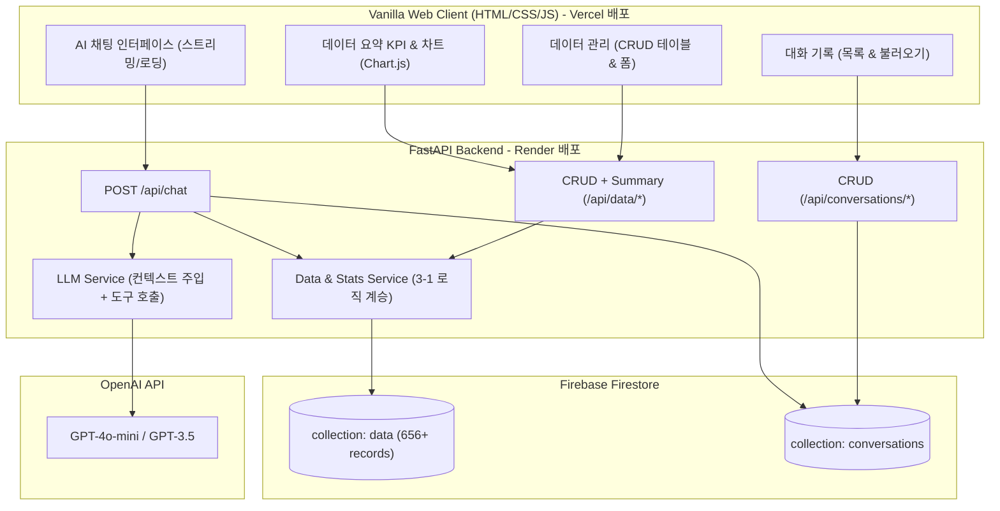

# [구현 계획] 3-1 분석 결과 연계 기반 나만의 AI 비서 구축 (3-2 미션)

3-1 프로젝트에서 구축한 **삼성전자(005930.KS) 2024~2026년 주가 시계열 분석 데이터(656건) 및 통계/트렌드 산출 로직**을 활용하여, `doc/mission.md`의 요구사항을 완벽히 충족하는 **"삼성전자 주가 분석 전문 AI 비서 웹 서비스"**를 구축하는 계획입니다.

---

## 1. 3-1 프로젝트 결과물 활용 방안

| 3-1 결과물 항목 | 3-2 미션 적용 및 연계 방안 |
| :--- | :--- |
| **시계열 데이터셋**<br>(`..\3-1\data\samsung_stock_2024_present.csv`) | 656개 거래일의 시계열 데이터를 Firestore `data` 컬렉션에 `(date, value, memo)` 포맷으로 일괄 마이그레이션(Seeding) 스크립트 작성.<br>• `date`: 거래일자 (YYYY-MM-DD)<br>• `value`: 종가 (Close, 원 단위)<br>• `memo`: 시가/고가/저가/거래량 요약 메타데이터 |
| **시계열 통계 및 추세 분석 알고리즘**<br>(`..\3-1\src\analysis_utils.py`) | `/api/data/summary` 엔드포인트의 통계 산출(총 레코드 수, 기간, 평균/최고/최저가, 최근 20일 이동평균 및 가격 변동률 기반 추세 분석) 로직에 직접 계승/이식 |
| **인사이트 및 도메인 지식**<br>(`..\3-1\REPORT.md`) | AI 챗봇 시스템 프롬프트(System Prompt)에 삼성전자 주가 도메인 특화 컨텍스트(반도체 사이클, 주요 저항/지지선 지표)와 데이터 요약을 결합하여 정교한 답변 제공 |
| **시각화 자산**<br>(`..\3-1\app.py`, 차트 로직) | 바닐라 JS 프론트엔드에 Chart.js(CDN)를 연동하여 삼성전자 주가 추세 및 이동평균선(SMA) 인터랙티브 차트 구현 |

---

## 2. 사용자 검토 필요 사항 (User Review Required)

> [!IMPORTANT]
> **외부 서비스 계정 및 API 키 준비 필요**
> 1. **OpenAI API Key**: AI 챗봇(`/api/chat`) 연동에 사용 (`OPENAI_API_KEY`)
> 2. **Firebase Firestore 서비스 계정 키**: 데이터 및 대화 저장을 위한 Firestore 연결 키 (`firebase-credentials.json` 또는 환경변수 `FIREBASE_SERVICE_ACCOUNT_JSON`)
>    - *로컬 개발 및 테스트 편의를 위해 Firestore 키가 없을 때도 테스트할 수 있는 **Local In-Memory / File Fallback 모드**를 지원하도록 설계할 예정입니다.*
> 3. **배포 플랫폼 계정**: Render (FastAPI 백엔드) 및 Vercel (바닐라 프론트엔드)

---

## 3. 주요 설계 및 아키텍처 (Architecture)



---

## 4. 세부 구현 계획 (Proposed Changes)

### Phase 1: 백엔드 아키텍처 및 데이터베이스 연동
FastAPI 기반 레이어드 아키텍처(Router - Service - Schema - DB)로 구축

#### [NEW] [requirements.txt](file:///d:/cody/3-2/requirements.txt)
- `fastapi`, `uvicorn[standard]`, `firebase-admin`, `openai`, `python-dotenv`, `pydantic`, `pandas`, `pytest`, `httpx`

#### [NEW] [backend/config.py](file:///d:/cody/3-2/backend/config.py)
- 환경변수 관리 (`OPENAI_API_KEY`, `FIREBASE_SERVICE_ACCOUNT_JSON` or Path, `CORS_ORIGINS`, `ENVIRONMENT` 등)

#### [NEW] [backend/database.py](file:///d:/cody/3-2/backend/database.py)
- Firestore 클라이언트 초기화
- 서비스 계정 키 파일 또는 Base64/JSON 환경변수 로딩 지원
- 테스트용 In-Memory Mock 모드(Firebase 미설정 시에도 로컬 개발 및 유닛 테스트 가능하도록 구현)

#### [NEW] [backend/schemas/data.py](file:///d:/cody/3-2/backend/schemas/data.py)
- `DataItemCreate`: `date` (YYYY-MM-DD 검증), `value` (float/int), `memo` (str)
- `DataItemUpdate`: 수정용 필드 (선택적)
- `DataItemResponse`: `id`, `date`, `value`, `memo`, `created_at`, `updated_at`
- `DataSummaryResponse`: `period`, `count`, `metrics` (total, avg, max, min, latest), `trend` (상승/하락/횡보 및 변동률)

#### [NEW] [backend/schemas/conversation.py](file:///d:/cody/3-2/backend/schemas/conversation.py)
- `Message`: `role` ('user' | 'assistant' | 'system'), `content`, `timestamp`
- `ConversationCreate`, `ConversationResponse`, `ConversationListItem`

#### [NEW] [backend/schemas/chat.py](file:///d:/cody/3-2/backend/schemas/chat.py)
- `ChatRequest`: `message`, `conversation_id` (선택), `stream` (선택)
- `ChatResponse`: `conversation_id`, `reply`, `summary_used`

---

### Phase 2: 비즈니스 로직 및 3-1 데이터 시딩/분석 서비스

#### [NEW] [backend/services/data_service.py](file:///d:/cody/3-2/backend/services/data_service.py)
- `data` 컬렉션에 대한 CRUD
- 3-1의 통계 산출 알고리즘(`analysis_utils.py`)을 계승한 요약 함수:
  - 전체 기간(`period`), 레코드 수(`count`), 평균/최대/최소(`metrics`), 최근 20일 이동평균 및 가격 모멘텀 기반 트렌드 산정(`trend`)

#### [NEW] [backend/services/conversation_service.py](file:///d:/cody/3-2/backend/services/conversation_service.py)
- 대화 생성/추가/조회/삭제 로직

#### [NEW] [backend/services/chat_service.py](file:///d:/cody/3-2/backend/services/chat_service.py)
- 컨텍스트 주입(Context Injection): 최신 `data/summary`를 시스템 프롬프트에 동적 삽입
- 도구 호출(Function Calling - 보너스 과제) 연동 스키마 정의 (`get_data_summary`, `search_stock_data`)
- OpenAI API 호출 및 대화 자동 저장

#### [NEW] [backend/scripts/seed_data.py](file:///d:/cody/3-2/backend/scripts/seed_data.py)
- 3-1 프로젝트의 `..\3-1\data\samsung_stock_2024_present.csv`를 읽어 `(date, value, memo)` 구조로 변환 후 Firestore에 일괄 등록하는 CLI 스크립트

---

### Phase 3: FastAPI 라우터 및 메인 엔드포인트 구현

#### [NEW] [backend/routers/data.py](file:///d:/cody/3-2/backend/routers/data.py)
- `POST /api/data`: 새 데이터 추가
- `GET /api/data`: 데이터 목록 조회 (정렬, 필터, 페이징 지원)
- `PUT /api/data/{id}`: 데이터 수정
- `DELETE /api/data/{id}`: 데이터 삭제
- `GET /api/data/summary`: 데이터 요약 (프롬프트 주입 및 대시보드용)
- `GET /api/data/export`: CSV / JSON 다운로드 (보너스 과제)

#### [NEW] [backend/routers/conversations.py](file:///d:/cody/3-2/backend/routers/conversations.py)
- `POST /api/conversations`: 대화 수동 저장
- `GET /api/conversations`: 대화 목록 조회
- `GET /api/conversations/{id}`: 특정 대화 메시지 전체 조회
- `DELETE /api/conversations/{id}`: 대화 삭제

#### [NEW] [backend/routers/chat.py](file:///d:/cody/3-2/backend/routers/chat.py)
- `POST /api/chat`: AI 챗봇 질의응답 (컨텍스트 자동 주입 + 대화 자동 저장)

#### [NEW] [backend/main.py](file:///d:/cody/3-2/backend/main.py)
- CORS 미들웨어 등록 (`ALLOWED_ORIGINS` 설정)
- 라우터 통합 및 헬스체크 (`GET /health`)
- 정적 파일 마운트 (로컬 통합 서빙 지원)

---

### Phase 4: 프리미엄 바닐라 프론트엔드 개발 (Vercel 배포용)
순수 HTML5, CSS3, ES6+ JavaScript로 구현 (외부 프레임워크 없음)

#### [NEW] [frontend/index.html](file:///d:/cody/3-2/frontend/index.html)
- 시맨틱 마크업: 사이드바(대화 기록), 메인 대시보드(KPI 요약 카드 + 추세 차트), AI 채팅 패널, 데이터 CRUD 관리 테이블
- 다크 모드 / 라이트 모드 토글 스위치
- Render 슬립(콜드스타트) 알림 배너

#### [NEW] [frontend/styles.css](file:///d:/cody/3-2/frontend/styles.css)
- 현대적인 글래스모피즘(Glassmorphism) 및 세련된 다크 테마 디자인 시스템
- 부드러운 애니메이션, 반응형 레이아웃(Grid & Flexbox), 로딩 스피너 및 타이핑 인디케이터

#### [NEW] [frontend/app.js](file:///d:/cody/3-2/frontend/app.js)
- 모듈화된 바닐라 JS 상태 관리:
  - `ChatModule`: 메시지 렌더링, 로딩 애니메이션, 자동 스크롤, 대화 이어하기
  - `DataModule`: CRUD 폼 모달, 테이블 렌더링, 페이지네이션, 수정/삭제 이벤트
  - `SummaryModule`: 요약 KPI 렌더링, Chart.js를 이용한 삼성전자 주가 추세 인터랙티브 차트
  - `ConversationModule`: 이전 대화 목록 불러오기, 대화방 전환, 삭제
  - `ExportModule`: CSV/JSON 내보내기

#### [NEW] [frontend/config.js](file:///d:/cody/3-2/frontend/config.js)
- 환경에 따른 `API_BASE_URL` 동적 결정 로직 (로컬: `http://localhost:8000`, 배포: Render URL)

---

### Phase 5: 배포 설정 및 최종 문서화

#### [NEW] [render.yaml](file:///d:/cody/3-2/render.yaml) & [Dockerfile](file:///d:/cody/3-2/Dockerfile)
- Render Web Service 자동 배포 설정

#### [NEW] [vercel.json](file:///d:/cody/3-2/vercel.json)
- Vercel 프론트엔드 라우팅 및 정적 사이트 배포 설정

#### [NEW] [README.md](file:///d:/cody/3-2/README.md)
- 서비스 소개 및 아키텍처 다이어그램
- 3-1 삼성전자 분석 결과 연계 설명
- 로컬 실행 가이드 (가상환경 설정, 패키지 설치, 데이터 시딩, 서버 실행)
- 환경 변수 가이드 (`.env.example` 포함)
- 배포 URL 안내 (Render Swagger, Vercel 웹)
- 필수 스크린샷 3종 (AI 채팅, 데이터 CRUD, 대화 기록) 포함 안내

---

## 5. 검증 계획 (Verification Plan)

### 자동화 테스트 (Automated Tests)
- `tests/test_api_data.py`: CRUD 4개 엔드포인트 및 `/api/data/summary` 데이터 검증 테스트
- `tests/test_api_conversations.py`: 대화 목록 조회, 특정 대화 불러오기, 삭제 테스트
- `tests/test_api_chat.py`: 시스템 프롬프트 컨텍스트 주입 및 챗봇 응답 포맷 테스트 (OpenAI Mocking 포함)
- 테스트 실행 명령:
  ```powershell
  pytest tests/ -v
  ```

### 로컬 통합 검증 (Manual / Browser Verification)
1. **3-1 데이터 시딩 검증**: `python backend/scripts/seed_data.py` 실행 후 656개 데이터 정상 적재 확인
2. **Swagger UI 검증**: `http://localhost:8000/docs` 접속하여 엔드포인트 규격 확인
3. **프론트엔드 UX 브라우저 검증**:
   - 요약 카드 및 Chart.js 주가 차트 정상 출력 여부 확인
   - 새 데이터 추가/수정/삭제 시 실시간 목록 갱신 확인
   - AI 채팅창에서 자연어 질의 ("최근 주가 흐름 어때?", "최고가는 얼마였어?") 시 데이터 요약 반영 답변 확인
   - 이전 대화 목록 클릭 시 과거 대화 복원 여부 확인
   - CSV 내보내기 및 다크 모드 전환 확인
