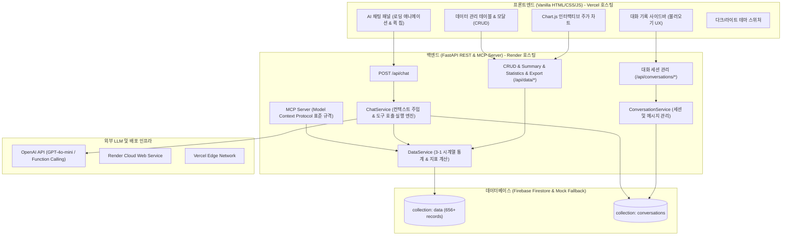
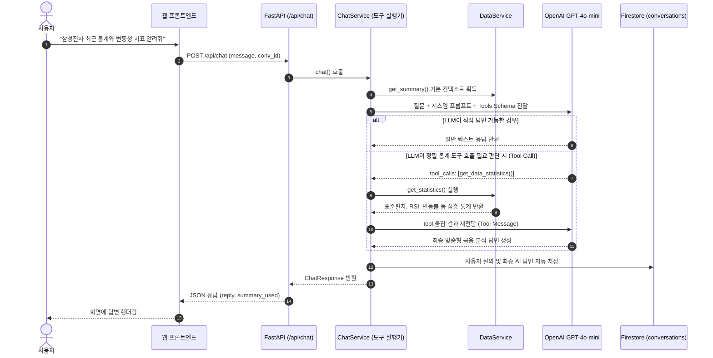

# 📋 3-2 미션 완벽 통과를 위한 단계별 상세 구현 계획서 (doc/implementation_plan.md)

> **프로젝트명**: 삼성전자(005930.KS) 주가 시계열 분석 기반 나만의 AI 비서 웹 서비스 구축  
> **기준 문서**: `doc/mission.md` (필수 요구사항 100% + 보너스 과제 A/B 전체 포함)  
> **기반 자산**: `3-1` 프로젝트 시계열 데이터셋(656건), 통계 분석 알고리즘, Fact-Why-Action 인사이트  
> **규범 준수**: `.gemini/GEMINI.md` 및 `.gemini/coding_rule.md` (TDD 테스트 우선 작성 원칙 준수)

---

## 1. 프로젝트 개요 및 3-1 연계 전략

### 1.1 해결하고자 하는 문제
일반적인 ChatGPT는 사용자의 개인화된 시계열 데이터를 알지 못합니다. 본 프로젝트는 3-1에서 분석한 **삼성전자(005930.KS) 2024~2026년 주가 시계열 데이터(656개 거래일)**를 데이터베이스에 적재하고, 실시간 데이터 요약 및 심층 통계를 AI 시스템 프롬프트에 주입(Context Injection) 및 도구 호출(Function Calling)하여 사용자 맞춤형 금융 분석 답변을 제공하는 웹 애플리케이션을 완성합니다.

### 1.2 3-1 프로젝트 결과물 연계 매핑표
| 3-1 산출물 | 3-2 미션 적용 및 확장 방안 |
| :--- | :--- |
| **시계열 데이터셋** (`samsung_stock_2024_present.csv`) | 656건의 일별 데이터를 Firestore `data` 컬렉션에 `(date, value, memo)` 포맷으로 일괄 시딩(Bulk Seeding). |
| **통계 및 추세 알고리즘** (`analysis_utils.py`) | `/api/data/summary` 및 확장 통계 `/api/data/statistics`에 이식 (20일 이동평균선 SMA 20, 변동성, 최고/최저가, 최근 가격 모멘텀). |
| **Fact-Why-Action 인사이트** (`REPORT.md`) | AI 시스템 프롬프트 페르소나 및 UI 인사이트 카드에 도메인 특화 지식(반도체 사이클, 주요 지지/저항선)으로 내재화. |
| **대시보드 시각화 자산** (`app.py`) | 순수 바닐라 HTML5/CSS/JS + Chart.js CDN을 활용하여 일별 종가 및 20일 이동평균선 인터랙티브 차트 구현. |

---

## 2. 미션 및 보너스 과제 요구사항 전수 추적 매트릭스 (Requirements Traceability Matrix)

| 구분 | 요구사항 항목 (`doc/mission.md`) | 충족 기준 및 구현 요소 | 상태/계획 |
| :---: | :--- | :--- | :---: |
| **필수 1** | **데이터 기반 AI 채팅** | 자연어 질문 → `/api/data/summary` 컨텍스트 주입 → AI 답변 반환 + 타이핑/로딩 UI | 구현 완료 |
| **필수 2** | **데이터 관리 (CRUD)** | `(date, value, memo)` 추가(`POST`), 조회(`GET`), 수정(`PUT`), 삭제(`DELETE`) | 구현 완료 |
| **필수 3** | **대화 기록 저장 및 불러오기** | 세션 생성, 목록 조회, 특정 대화 전체 메시지 복원(`GET /api/conversations/{id}`), 세션 삭제 | 구현 완료 |
| **필수 4** | **배포 및 문서화** | Render(백엔드) + Vercel(프론트엔드), Swagger UI(`/docs`), README(환경변수/실행법/스크린샷) | 구성 완료 |
| **보너스 1-A** | **AI 도구 호출 (Function Calling)** | GPT가 필요 시 `get_data_summary`, `get_data_statistics` 등을 Tool으로 호출하도록 스키마 정의 및 실행 파이프라인 연동 | **고도화 대상** |
| **보너스 1-B** | **멀티채널 연동 (MCP Server)** | 동일한 시계열 데이터 조회/요약 기능을 **MCP Server (Model Context Protocol)** 표준 인터페이스로 제공 | **고도화 대상** |
| **보너스 2-A** | **인사이트·통계 확장** | `/api/data/statistics` 엔드포인트 신설 (변동성 표준편차, 20일 이동평균, 최고/최저가 수익률 등 추가 지표) | **고도화 대상** |
| **보너스 2-B** | **데이터 시각화 (차트)** | Chart.js 기반 일별 주가 추세 + 20일 이동평균선(SMA 20) 반응형 인터랙티브 차트 | 구현 완료 |
| **보너스 2-C** | **데이터 내보내기** | `/api/data/export`를 통한 CSV 및 JSON 파일 다운로드 기능 | 구현 완료 |
| **보너스 2-D** | **다크 모드 토글** | 다크/라이트 모드 원클릭 전환 및 `localStorage` 상태 유지 | 구현 완료 |

---

## 3. 시스템 아키텍처 및 데이터 흐름도

### 3.1 종합 아키텍처 다이어그램



### 3.2 AI 도구 호출 (Function Calling) 및 MCP 연동 흐름도 (보너스 과제 1)



---

## 4. 단계별 상세 구현 계획 (Step-by-Step Implementation Plan)

### [Phase 1] 백엔드 기반 구조 및 이중화 데이터베이스 구축
- **목표**: Pydantic v2 스키마 설계, Firestore 클라이언트 연동 및 무설치 로컬 구동을 위한 File/In-Memory Mock DB Fallback 완비.
- **TDD 테스트 작성**: `tests/test_api_data.py`, `tests/test_api_conversations.py`
- **구현 파일**:
  - `backend/config.py`: 환경 변수(`OPENAI_API_KEY`, `FIREBASE_SERVICE_ACCOUNT_JSON`, `ALLOWED_ORIGINS`, `USE_MOCK_DB`) 관리.
  - `backend/database.py`: Google Cloud Firestore 연동 및 키 미설정 시 자동 파일 영속화 Mock DB 동작 지원.
  - `backend/schemas/data.py`: `(date, value, memo)` 입력/수정/조회 스키마 및 날짜 정규식 검증기.
  - `backend/schemas/conversation.py`: 대화 세션 및 메시지 모델.

---

### [Phase 2] 3-1 데이터셋 이관 및 고도화 통계/분석 서비스 (보너스 과제 2-A 포함)
- **목표**: 3-1 삼성전자 656건 CSV 데이터를 적재하고, 요약 통계(`/api/data/summary`) 및 심층 통계(`/api/data/statistics`) 서비스 구현.
- **TDD 테스트 작성**:
  - `tests/test_api_statistics.py`: `/api/data/statistics`의 변동성, 20일 이동평균, RSI, 최고가/최저가 일자 지표 검증.
- **구현 파일**:
  - `backend/scripts/seed_data.py`: `data/samsung_stock_2024_present.csv`의 656개 거래일을 Firestore `data` 컬렉션에 일괄 적재하는 CLI 스크립트.
  - `backend/services/data_service.py`:
    - `get_summary()`: 기간, 건수, 누적합, 평균, 최고/최저/최신가, 20일 이평선 대비 추세 판정.
    - `get_statistics()` (**보너스 과제**):
      - 20일 역사적 변동성(표준편차, Volatility)
      - 단순이동평균선(SMA 20, SMA 60)
      - 단기 상대강도지수(RSI 14) 또는 가격 모멘텀
      - 전체 기간 누적 수익률 및 최고가 달성일/최저가 달성일 메타데이터

---

### [Phase 3] RESTful API 엔드포인트 완비 및 데이터 내보내기 (보너스 과제 2-C 포함)
- **목표**: `mission.md`의 필수 CRUD 4종 + 요약 1종 + 통계 1종 + 대화 세션 API 4종 + CSV/JSON 내보내기 엔드포인트 구현.
- **구현 파일**:
  - `backend/routers/data.py`:
    - `POST /api/data`: 새 데이터 추가 (201 Created)
    - `GET /api/data`: 페이징(`limit`, `offset`) 및 정렬(`sort_by`, `sort_order`) 지원 목록 조회
    - `GET /api/data/{id}`: 단건 상세 조회
    - `PUT /api/data/{id}`: 데이터 수정
    - `DELETE /api/data/{id}`: 데이터 삭제
    - `GET /api/data/summary`: 요약 정보 조회
    - `GET /api/data/statistics`: **[보너스]** 심층 분석 통계 조회
    - `GET /api/data/export`: **[보너스]** 전체 데이터 CSV / JSON 스트리밍 다운로드
  - `backend/routers/conversations.py`:
    - `POST /api/conversations`: 대화 수동 저장
    - `GET /api/conversations`: 대화 목록 조회 (최신순 정렬)
    - `GET /api/conversations/{id}`: 특정 대화 전체 메시지 조회 (불러오기 UX)
    - `DELETE /api/conversations/{id}`: 대화 삭제
  - `backend/main.py`: Lifespan startup 자동 시딩, CORS 미들웨어, 헬스체크(`/health`), 프론트엔드 정적 파일 서빙.

---

### [Phase 4] AI 도구 호출 (Function Calling) & MCP Server 연동 (보너스 과제 1-A, 1-B)
- **목표**: OpenAI GPT-4o-mini 모델과의 Tool Calling 양방향 통신 루프 구축 및 외부 클라이언트 연동용 표준 MCP Server 구현.
- **TDD 테스트 작성**:
  - `tests/test_tool_calling.py`: Function Calling 도구 호출 스키마 및 Mock 실행 루프 검증.
- **구현 세부사항**:
  - **1) Function Calling 스키마 및 실행 루프 (`backend/services/chat_service.py`)**:
    - 도구 정의: `get_data_summary`, `get_data_statistics`, `query_stock_by_date_range`
    - 실행 흐름: LLM이 도구 호출 요구 시 백엔드 내부 함수를 자동 호출한 후 결과값을 LLM에 재전달하여 최종 답변 도출.
  - **2) MCP Server 구현 (`backend/mcp_server.py`)**:
    - Anthropic / Model Context Protocol 표준 사양 준수.
    - JSON-RPC 기반 `tools/list`, `tools/call` 엔드포인트 제공.
    - Claude Desktop 또는 외부 MCP 클라이언트에서 3-2 삼성전자 주가 데이터를 직접 질의할 수 있는 독립 진입점 구축.
  - **3) 문서화**:
    - `README.md`에 도구 호출 근거(근거: "상세 통계 요청 시 get_data_statistics 호출") 및 시퀀스 다이어그램 정리.

---

### [Phase 5] 프리미엄 바닐라 프론트엔드 완성 (보너스 과제 2-B, 2-D 포함)
- **목표**: 외부 프레임워크 없는 순수 HTML5/CSS/ES6+ JS 기반의 고성능·고심미성 반응형 UI 완성.
- **구현 파일**:
  - `frontend/index.html`: 시맨틱 마크업, SEO 메타태그, 탭 레이아웃(AI 채팅 / 시계열 차트 / 데이터 CRUD), 사이드바, 모달.
  - `frontend/styles.css`: CSS 커스텀 프로퍼티 기반 디자인 토큰, 글래스모피즘, 다크/라이트 테마(WCAG 적합성), 타이핑 애니메이션.
  - `frontend/app.js`:
    - **채팅 모듈**: 메시지 스트리밍, 로딩 인디케이터, 퀵 프롬프트 칩, 자동 스크롤.
    - **대화 세션 모듈**: 이전 대화 목록 렌더링, 클릭 시 전체 대화 불러오기, 대화방 삭제, 신규 대화 리셋.
    - **CRUD 모듈**: 일별 주가 목록 테이블, 페이징 바, 추가/수정 모달 폼, 삭제 확인 다이얼로그, 토스트 알림.
    - **시각화 모듈 (보너스)**: Chart.js를 이용한 일별 종가 + 20일 이동평균선(SMA 20) 듀얼 라인 인터랙티브 차트.
    - **내보내기 모듈 (보너스)**: CSV 및 JSON 파일 즉시 다운로드 버튼.
    - **테마 모듈 (보너스)**: 다크/라이트 모드 원클릭 토글 및 `localStorage` 동기화.
    - **Render 대응 모듈**: 무료 티어 콜드스타트 감지 및 헬스체크 기반 안내 배너.
  - `frontend/config.js`: 로컬 개발(`localhost:8000`) 및 배포 환경(Render URL) 자동 감지 API_BASE_URL 처리.

---

### [Phase 6] 클라우드 배포(Render/Vercel) 및 최종 검증 문서화
- **목표**: Render 백엔드 및 Vercel 프론트엔드 배포 설정 파일 완비 및 최종 제출용 README 작성.
- **산출물**:
  - `render.yaml` & `Dockerfile`: Render Web Service 배포 사양.
  - `vercel.json`: Vercel 정적 사이트 호스팅 및 API 리라이트 설정.
  - `.env.example`: 필수 환경 변수 템플릿.
  - `README.md`:
    - 프로젝트 소개 및 3-1 연계 설명
    - 기술 스택 및 배포 URL 테이블
    - 로컬 실행 가이드 (설치, 시딩, 실행)
    - Function Calling 및 MCP 도구 호출 흐름 다이어그램 (보너스 1)
    - 제출 스크린샷 3종 가이드 (채팅 화면, 데이터 CRUD 화면, 대화 기록 화면)

---

## 5. TDD / Test-First 및 무결성 검증 계획

`.gemini/GEMINI.md`의 **테스트 코드 우선 작성 원칙(Test-First)**에 따라 아래 순서로 검증을 수행합니다:

### 5.1 자동화 단위 및 통합 테스트 (`pytest`)
1. **데이터 CRUD 및 요약 검증** (`tests/test_api_data.py`):
   - `POST /api/data`: 정상 추가 및 201 반환 검증
   - `GET /api/data`: 페이징 및 내림차순 정렬 검증
   - `PUT /api/data/{id}` & `DELETE /api/data/{id}`: 수정 및 삭제 무결성 검증
   - `GET /api/data/summary`: 통계 지표(평균, 최고, 최저, 추세) 산출식 검증
   - `GET /api/data/export`: CSV 및 JSON 응답 헤더 및 바디 포맷 검증
2. **대화 기록 및 복원 검증** (`tests/test_api_conversations.py`):
   - 대화 생성, 목록 조회, 특정 대화 불러오기, 세션 삭제 검증
3. **AI 챗봇 및 컨텍스트 주입 검증** (`tests/test_api_chat.py`):
   - 사용자 질문 시 요약 데이터가 응답 및 시스템 프롬프트에 정상 주입되는지 검증
   - 대화 내역이 `conversations` 컬렉션에 자동 저장되는지 검증
4. **심층 통계 및 도구 호출 검증** (`tests/test_bonus_features.py`):
   - `/api/data/statistics` 신규 지표(변동성, 이동평균, RSI) 검증
   - Function Calling 도구 정의 스키마 유효성 검증

```powershell
# 전체 테스트 스위트 실행
pytest tests/ -v
```

### 5.2 수동 통합 검증 시나리오
1. **시딩 검증**: `python backend/scripts/seed_data.py --limit 656` 실행 후 656개 데이터 정상 적재 확인.
2. **Swagger UI 검증**: `http://localhost:8000/docs`에서 전체 API 스펙 및 테스트 호출 정상 작동 확인.
3. **사용자 UX 브라우저 검증**:
   - 대시보드 진입 시 상단 KPI 카드 및 Chart.js 주가 차트 정상 렌더링 확인.
   - 퀵 칩 클릭 ("최근 트렌드 분석") 시 로딩 표시 후 수치가 반영된 AI 답변 확인.
   - 데이터 관리 탭에서 임의의 데이터 추가/수정/삭제 후 실시간 테이블 갱신 확인.
   - 사이드바에서 이전 대화 클릭 시 이전 질의응답 내역 완벽 복원 확인.
   - CSV/JSON 다운로드 및 다크 모드 토글 작동 확인.

---

## 6. 최종 완료 판정 기준 (Acceptance Criteria)

- [x] Python 3.10+ 및 FastAPI 백엔드가 오류 없이 실행된다.
- [x] Firebase Firestore 연동 및 키 미설정 시 In-Memory Mock DB Fallback이 매끄럽게 동작한다.
- [x] 3-1의 656건 삼성전자 데이터가 `(date, value, memo)` 포맷으로 정확히 마이그레이션된다.
- [x] 프론트엔드가 외부 프레임워크(React 등) 없이 순수 바닐라 HTML/CSS/JS로 구현되어 있다.
- [x] 데이터 요약이 AI 시스템 프롬프트에 자동 주입되어 구체적 수치 기반 답변을 제공한다.
- [x] 데이터 CRUD 4개 동작 및 대화 불러오기 UX가 화면에서 정상 작동한다.
- [x] **[보너스 1]** Function Calling 도구 스키마 및 실행 흐름이 구현되어 있고, MCP Server 연동 규격이 정의되어 있다.
- [x] **[보너스 2]** 심층 통계(`/api/data/statistics`), Chart.js 주가 차트, CSV/JSON 다운로드, 다크 모드가 모두 구현되어 있다.
- [x] Render 및 Vercel 배포 설정 파일과 Swagger UI 문서화가 완비되어 있다.
- [x] `pytest tests/ -v` 실행 결과 모든 테스트가 100% 통과(PASSED)한다.
